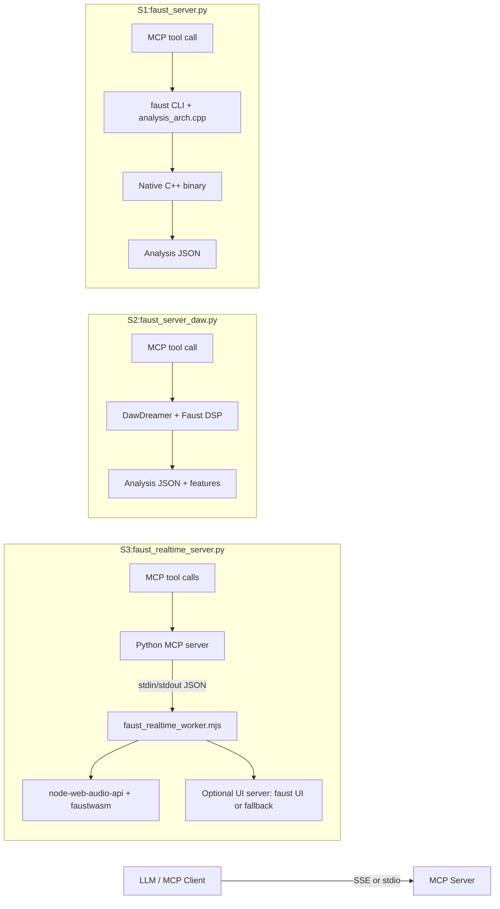

# Faust MCP Servers

This repository provides three MCP servers that compile, render, or play Faust DSP code:

- `faust_server.py`: C++ compile pipeline (Faust CLI + g++).
- `faust_server_daw.py`: DawDreamer offline render pipeline.
- `faust_realtime_server.py`: real-time playback via node-web-audio-api + Faust WASM.

## Structure

- `faust_server.py`: MCP server entrypoint (FastMCP) and tool implementation.
- `faust_server_daw.py`: DawDreamer-based MCP server (no C++ compile step).
- `faust_realtime_server.py`: Real-time MCP server using node-web-audio-api + Faust WASM.
- `faust_realtime_worker.mjs`: Node worker that hosts the real-time DSP graph.
- `analysis_arch.cpp`: Faust C++ architecture used to generate analysis data.
- `t1.dsp`, `t2.dsp`, `noise.dsp`: Example Faust DSP programs.
- `sse_client_example.py`: SSE client example.
- `stdio_client_example.py`: stdio client example.
- `smoke_test.py`: Basic stdio smoke test for both offline servers.
- `Makefile`: Common run/test targets.
- `requirements.txt`: Client-side Python dependencies.

## Architecture overview

The project has three MCP server variants that share a common client interface,
but differ in how they compile/render Faust DSP code.



Notes:

- SSE is the recommended transport for web clients; stdio is useful for local CLI tools.
- The real-time server returns parameter metadata and current values, not offline analysis.
- Real-time tools: `compile_and_start`, `check_syntax`, `get_params`, `set_param`, `set_param_values`, `get_param`, `get_param_values`, `stop`.
- Offline tools: `compile_and_analyze`.
- DawDreamer and real-time servers accept optional `input_source` (`none`, `sine`, `noise`, `file`), `input_freq` (Hz), and `input_file` (path) to inject test inputs.

## Quick Start

```bash
make setup
make smoke-test DSP=t1.dsp
```

Real-time setup:

```bash
make setup-rt
```

Faust UI setup (optional):

```bash
make setup-ui
```

Cleanup:

```bash
make clean
```

## Shared Environment Variables

- `MCP_HOST` (default: `127.0.0.1`)
- `MCP_PORT` (default: `8000`)
- `MCP_TRANSPORT` (default: `sse`)
  - Supported values: `sse`, `streamable-http`, `stdio`
- `MCP_MOUNT_PATH` (optional, SSE only)
- `TMPDIR` (recommended) temp folder used by the compiler toolchain

## Server 1: C++ Compile Pipeline (`faust_server.py`)

### What it does

1. Accept a Faust DSP string via the `compile_and_analyze` tool.
2. Write it to a temporary `process.dsp` file.
3. Compile Faust DSP to C++ using `analysis_arch.cpp`.
4. Compile the generated C++ into a native binary (C++11+).
5. Run the binary to produce JSON analysis output.
6. Return the JSON result to the MCP client.

### Requirements

- Python 3.10+
- Faust CLI available in PATH (`faust`)
- C++ compiler (`g++`) with C++11+ support
- Python package `mcp`

### Run (SSE)

```bash
MCP_TRANSPORT=sse MCP_HOST=127.0.0.1 MCP_PORT=8000 \
TMPDIR=/path/to/tmp \
python3 faust_server.py
```

Default SSE endpoint:

- `http://127.0.0.1:8000/sse`

### Run (stdio)

```bash
MCP_TRANSPORT=stdio python3 faust_server.py
```

For `faust_server.py`, set `TMPDIR` to a writable path if compilation fails:

```bash
MCP_TRANSPORT=stdio TMPDIR=/tmp/faust-mcp-test python3 faust_server.py
```

### Tool: compile_and_analyze

**Input:**

- `faust_code` (string) - the DSP source code

**Output:**

JSON string with:

- `status`
- `max_amplitude`
- `rms`
- `is_silent`
- `waveform_ascii`
- `num_outputs`
- `channels` (array of per-output metrics)

### How analysis_arch.cpp computes outputs

The analysis is performed by `analysis_arch.cpp` and returns a JSON payload with
these fields:

- `status`: hard-coded to `"success"` when the binary completes.
- `max_amplitude`: maximum absolute value of the **mono mix** over the full render.
  The mono mix is the average of all output channels per sample.
- `rms`: root-mean-square of the mono mix over the full render.
- `is_silent`: `true` when `max_amplitude < 0.0001`, otherwise `false`.
- `waveform_ascii`: a 60-character ASCII summary of the mono mix. Each character
  represents a chunk of the rendered buffer and is chosen by peak magnitude:
  `_` for near-silence (< 0.01), `#` for > 0.5, `=` for > 0.2, and `-` otherwise.
- `num_outputs`: number of output channels produced by the DSP.
- `channels`: array of per-output objects with:
  - `index` (0-based output index)
  - `max_amplitude`
  - `rms`
  - `is_silent`
  - `waveform_ascii`

Render details:

- Sample rate: 44100 Hz
- Duration: 2 seconds (88200 samples)
- Processing block size: 256 frames

## Server 2: DawDreamer Offline Pipeline (`faust_server_daw.py`)

### What it does

This variant uses [DawDreamer](https://github.com/DBraun/DawDreamer) to compile 
and render Faust DSP directly in Python, so you do not need to generate and compile C++ code. 
It renders offline audio and returns the same analysis metrics plus a `dawdreamer` info block and
DawDreamer-only features.

### Requirements

- Python 3.10+
- `dawDreamer` (import name can be `dawDreamer` or `dawdreamer`)
- `numpy` for spectral features (otherwise `spectral_available` is `false`)

Install:

```bash
python3 -m pip install dawDreamer
```

### Environment variables

- `DD_SAMPLE_RATE`, `DD_BLOCK_SIZE`, `DD_RENDER_SECONDS` for rendering
- `DD_FFT_SIZE`, `DD_FFT_HOP`, `DD_ROLLOFF` for spectral analysis

### Tool additions

`compile_and_analyze` accepts optional `input_source` (`none`, `sine`, `noise`, `file`),
`input_freq` (Hz for sine, default 1000), and `input_file` (path for file) to inject
test inputs for effects. For DawDreamer, `input_file` must be a local WAV path
and requires `numpy` for decoding.

### Run (SSE)

```bash
MCP_TRANSPORT=sse MCP_HOST=127.0.0.1 MCP_PORT=8000 \
DD_SAMPLE_RATE=44100 DD_BLOCK_SIZE=256 DD_RENDER_SECONDS=2.0 \
python3 faust_server_daw.py
```

Makefile targets:

```bash
make run-daw
make client-daw DSP=t1.dsp
```

`make client-daw DSP=...` runs the SSE client against the DawDreamer server using
that DSP file. You can also use:

```bash
make client-sse DSP=t1.dsp
```

`compile_and_analyze` with a test input source (DawDreamer):

```bash
python3 sse_client_example.py --url http://127.0.0.1:8000/sse \
  --tool compile_and_analyze --dsp t1.dsp --input-source noise
```

### DawDreamer output additions

- `features` (global time + spectral features)
- Per-channel `features`
- `dawdreamer` object with render settings and version info

Example output (truncated):

```json
{
  "status": "success",
  "max_amplitude": 0.990577,
  "rms": 0.49998,
  "is_silent": false,
  "waveform_ascii": "############################################################",
  "num_outputs": 2,
  "features": {
    "dc_offset": 0.0001,
    "zero_crossing_rate": 0.022,
    "crest_factor": 1.98,
    "clipping_ratio": 0.0,
    "spectral_centroid": 1000.0,
    "spectral_bandwidth": 120.0,
    "spectral_rolloff": 1500.0,
    "spectral_flatness": 0.12,
    "spectral_flux": 0.04,
    "spectral_frame_size": 2048,
    "spectral_hop_size": 1024,
    "spectral_rolloff_ratio": 0.85,
    "spectral_available": true
  },
  "channels": [
    {
      "index": 0,
      "max_amplitude": 1.0,
      "rms": 0.707111,
      "is_silent": false,
      "waveform_ascii": "############################################################",
      "features": {
        "dc_offset": 0.0001,
        "zero_crossing_rate": 0.022,
        "crest_factor": 1.98,
        "clipping_ratio": 0.0,
        "spectral_centroid": 1000.0,
        "spectral_bandwidth": 120.0,
        "spectral_rolloff": 1500.0,
        "spectral_flatness": 0.12,
        "spectral_flux": 0.04,
        "spectral_frame_size": 2048,
        "spectral_hop_size": 1024,
        "spectral_rolloff_ratio": 0.85,
        "spectral_available": true
      }
    }
  ],
  "dawdreamer": {
    "version": "0.7.0",
    "sample_rate": 44100,
    "block_size": 256,
    "render_seconds": 2.0,
    "num_channels": 2
  }
}
```

## Server 3: Real-time WebAudio Pipeline (`faust_realtime_server.py`)

### What it does

This variant compiles Faust DSP code to WebAudio on the fly and plays it in real time
using the `node-web-audio-api` runtime. It returns parameter metadata extracted from
the Faust JSON so an LLM can control the running DSP (no offline analysis metrics).

[node-web-audio-api](https://github.com/ircam-ismm/node-web-audio-api) is an open-source Node.js implementation 
of the Web Audio API that provides AudioContext/AudioWorklet support outside the browser, backed by
native audio I/O. 

### Requirements

- Node.js
- `node-web-audio-api` checkout at `WEBAUDIO_ROOT` (submodule: `external/node-web-audio-api`)
- `@grame/faustwasm` installed in that checkout
- Optional: `@shren/faust-ui` installed in `ui/` for the UI bridge

Environment variables:

- `WEBAUDIO_ROOT`: node-web-audio-api path (default `external/node-web-audio-api`)
- `FAUST_UI_PORT`: enable UI server on this port (optional)
- `FAUST_UI_ROOT`: path to a built `faust-ui` bundle (optional, overrides auto-detect)

Submodule setup (one-time):

```bash
git submodule update --init --recursive
cd external/node-web-audio-api
npm install
npm run build
```

### Notes

- The real-time server runs one DSP at a time; `compile_and_start` replaces it.
- Parameter paths come from Faust JSON, not `RT_NAME`. Use `make rt-get-params`.
- `npm run build` generates `node-web-audio-api.build-release.node` and should be re-run
  if you update the submodule or switch branches.
- If you get no sound, check OS audio permissions and the default output device.

### Run (SSE)

```bash
WEBAUDIO_ROOT=external/node-web-audio-api \
MCP_TRANSPORT=sse MCP_HOST=127.0.0.1 MCP_PORT=8000 \
python3 faust_realtime_server.py
```

### Optional UI bridge

Set `FAUST_UI_PORT` to start a small HTTP UI server (fallback sliders). If you
have the `@shren/faust-ui` package installed (in `ui/`), the server will auto-load
it. You can also point `FAUST_UI_ROOT` to a custom bundle directory so the page
can load `/faust-ui/index.js` and use it instead of the fallback UI.

The UI page (`ui/rt-ui.html`) connects to the running DSP over a lightweight
HTTP JSON API hosted by the Node worker (`faust_realtime_worker.mjs`) using
Node's built-in `http` server. This is separate from the MCP transport: MCP
still runs over SSE/stdio between the Python server and the client, while the UI
talks directly to the worker via HTTP.

Endpoints used by the UI:

- `GET /status`: current DSP name and running status
- `GET /json`: full Faust JSON for the current DSP
- `GET /params`: cached parameter metadata
- `GET /param-values`: current parameter values (polled)
- `POST /param`: set a parameter value `{ path, value }`
- `GET /faust-ui/*`: static assets for `@shren/faust-ui` (optional)

The page polls `/json` and `/status` to detect DSP changes, and polls
`/param-values` on a short interval (≈1.5s in `rt-ui.html`) to keep the UI
in sync with parameter updates coming from MCP (`set_param`).

```bash
WEBAUDIO_ROOT=external/node-web-audio-api \
FAUST_UI_PORT=8787 FAUST_UI_ROOT=/path/to/faust-ui/dist/esm \
MCP_TRANSPORT=sse MCP_HOST=127.0.0.1 MCP_PORT=8000 \
python3 faust_realtime_server.py
```

If you want Claude Code over stdio and the UI at the same time, run the server
in stdio mode with `FAUST_UI_PORT` set:

```bash
WEBAUDIO_ROOT=external/node-web-audio-api \
FAUST_UI_PORT=8787 FAUST_UI_ROOT=/path/to/faust-ui/dist/esm \
MCP_TRANSPORT=stdio \
python3 faust_realtime_server.py
```

Then open:

- `http://127.0.0.1:8787/`

### Real-time tools

- `compile_and_start(faust_code, name?, latency_hint?, input_source?, input_freq?, input_file?)`
- `check_syntax(faust_code, name?)`
- `get_params()`
- `get_param(path)`
- `get_param_values()`
- `set_param_values(values)`
- `set_param(path, value)`
- `stop()`

`latency_hint` accepts `interactive` (default) or `playback`.
`input_source` accepts `none` (default), `sine`, `noise`, or `file`. `input_freq`
sets the sine frequency in Hz (default 1000). `input_file` sets the path for a
soundfile input when `input_source=file`.

For the real-time server (faustwasm), soundfiles must be served over HTTP/HTTPS.
To test local files, start a simple server in the repo root:

```bash
python3 -m http.server 9000
```

### Python ↔ Node worker bridge

The real-time server runs a Node worker process and talks to it over stdin/stdout:

- `faust_realtime_server.py` starts the worker with `node faust_realtime_worker.mjs`
  and passes `WEBAUDIO_ROOT` in the environment.
- The worker reads JSON lines like:
  `{ "id": 1, "method": "compile_and_start", "params": {...} }`
- It responds with:
  `{ "id": 1, "result": {...} }` or `{ "id": 1, "error": "..." }`
- The Python server forwards MCP tool calls to the worker and returns the result.

## Example DSP Files

`t1.dsp`:

```faust
import("stdfaust.lib");

cutoff = hslider("cutoff[Hz]", 1200, 50, 8000, 1);
drive = hslider("drive[dB]", 0, -24, 24, 0.1) : ba.db2linear;

process = _ * drive : fi.lowpass(2, cutoff);
```

`t2.dsp`:

```faust
import("stdfaust.lib");

freq1 = hslider("freq1[Hz]", 500, 50, 2000, 1);
freq2 = hslider("freq2[Hz]", 600, 50, 2000, 1);
gain = hslider("gain[dB]", -6, -60, 6, 0.1) : ba.db2linear;

process = os.osc(freq1) * gain, os.osc(freq2) * gain;
```

`noise.dsp`:

```faust
import("stdfaust.lib");

gain = hslider("gain[dB]", -6, -60, 6, 0.1) : ba.db2linear;

process = no.noise * gain;
```

## Clients

## LLM + MCP usage

Example flow for Claude Code or another MCP-capable LLM:

1. Start the desired server (`faust_server.py`, `faust_server_daw.py`, or `faust_realtime_server.py`).
2. The LLM connects over SSE or stdio and lists available tools.
3. The LLM sends DSP code to `compile_and_analyze` (offline servers) or `compile_and_start` (real-time).
4. The server returns analysis metrics (offline) or parameter metadata (real-time).
5. The LLM uses `set_param/set_param_values` to adjust controls, and `get_param/get_param_values` to read back state.

Minimal real-time loop (conceptual):

```text
compile_and_start(faust_code="...", name="osc1")
get_param_values()
set_param(path="/freq", value=440)
set_param_values(values=[{"path": "/gain", "value": 0.2}, {"path": "/cutoff", "value": 1200}])
```

To list available tools from a local SSE server, use:

```bash
python3 scripts/list_tools.py
python3 scripts/list_tools.py --details
```

## Typical use cases

Local file server for soundfile inputs:

```bash
python3 -m http.server 9000
```

Offline analysis with a sine test input (DawDreamer):

```bash
make run-daw
make client-daw DSP=t1.dsp INPUT_SOURCE=sine INPUT_FREQ=1000
```

Offline analysis with a soundfile test input (DawDreamer, local path):

```bash
make run-daw
make client-daw DSP=t1.dsp INPUT_SOURCE=file INPUT_FILE=tests/assets/sine.wav
```

If you see `addSoundfile : soundfile for sound cannot be created`, make sure the
path points to a local WAV file (HTTP URLs are for the real-time server).

Real-time compile with noise test input:

```bash
make run-rt
make rt-compile DSP=t1.dsp RT_NAME=fx INPUT_SOURCE=noise
```

Real-time compile with a soundfile test input (HTTP URL):

```bash
make run-rt-ui
make rt-compile DSP=t1.dsp RT_NAME=fx INPUT_SOURCE=file INPUT_FILE=http://127.0.0.1:9000/tests/assets/sine.wav
```

### SSE client

```bash
python3 sse_client_example.py --url http://127.0.0.1:8000/sse --dsp t1.dsp
```

`compile_and_start` example:

```bash
python3 sse_client_example.py --url http://127.0.0.1:8000/sse \
  --tool compile_and_start --dsp t1.dsp --name osc1 --latency interactive
```

With a test input source:

```bash
python3 sse_client_example.py --url http://127.0.0.1:8000/sse \
  --tool compile_and_start --dsp t1.dsp --name osc1 --latency interactive \
  --input-source sine --input-freq 1000
```

With a file test input:

```bash
python3 sse_client_example.py --url http://127.0.0.1:8000/sse \
  --tool compile_and_start --dsp t1.dsp --name osc1 --latency interactive \
  --input-source file --input-file http://127.0.0.1:9000/tests/assets/sine.wav
```

`tests/assets/sine.wav` is a mono 1 kHz test file included in this repo.

### stdio client

```bash
python3 stdio_client_example.py --dsp t1.dsp
```

Real-time over stdio:

```bash
MCP_TRANSPORT=stdio python3 faust_realtime_server.py
```

```bash
python3 stdio_client_example.py --server faust_realtime_server.py \
  --tool compile_and_start --dsp t1.dsp --name fx --latency interactive \
  --input-source noise
```

## Local verification checklist

These commands exercise the common server/client combinations on a local machine:

```bash
# C++ server (stdio)
python3 stdio_client_example.py --server faust_server.py --dsp t1.dsp --tmpdir /tmp/faust-mcp-test

# DawDreamer server (stdio, file input)
python3 stdio_client_example.py --server faust_server_daw.py --dsp t1.dsp \
  --input-source file --input-file tests/assets/sine.wav

# Real-time server (SSE)
WEBAUDIO_ROOT=external/node-web-audio-api MCP_PORT=8000 \
python3 faust_realtime_server.py

python3 sse_client_example.py --url http://127.0.0.1:8000/sse \
  --tool compile_and_start --dsp t1.dsp --name fx --latency interactive \
  --input-source noise
```

### Makefile real-time helpers

```bash
make run-rt
make run-rt-ui
make run-rt-stdio
make run-rt-stdio-ui
make rt-compile DSP=t1.dsp RT_NAME=osc1
make rt-get-params
make rt-get-param RT_PARAM_PATH=/freq
make rt-set-param RT_PARAM_PATH=/freq RT_PARAM_VALUE=440
make rt-stop
```

## Transport matrix

| Server | Transport | Client | Works |
| --- | --- | --- | --- |
| `faust_server.py` | SSE | `sse_client_example.py` / `make client-sse` | Yes |
| `faust_server.py` | stdio | `stdio_client_example.py` / `make client-stdio` | Yes |
| `faust_server_daw.py` | SSE | `sse_client_example.py` / `make client-daw` | Yes |
| `faust_server_daw.py` | stdio | `stdio_client_example.py` | Yes |
| `faust_realtime_server.py` | SSE | `sse_client_example.py` | Yes |
| `faust_realtime_server.py` | stdio | `stdio_client_example.py` | Yes |

## Client configuration examples

### Claude Desktop (SSE)

Edit `~/.config/Claude/claude_desktop_config.json` and add:

```json
{
  "mcpServers": {
    "faust": {
      "type": "sse",
      "url": "http://127.0.0.1:8000/sse"
    }
  }
}
```

### Generic MCP config (stdio)

If your MCP client reads a `servers.json` file, add a stdio server entry:

```json
{
  "servers": {
    "faust": {
      "command": "python3",
      "args": ["/path/to/faust-mcp/faust_server.py"],
      "env": {
        "MCP_TRANSPORT": "stdio",
        "TMPDIR": "/path/to/faust-mcp/tmp"
      }
    }
  }
}
```

## Troubleshooting

- If the compiler cannot create temp files, set `TMPDIR` to a writable location.
- Ensure the `tmp/` directory exists if you use `TMPDIR=./tmp` (create it once with `mkdir -p tmp`).
- If the server cannot bind to `127.0.0.1:8000`, either stop the process using
  that port or change `MCP_PORT` to another value.
