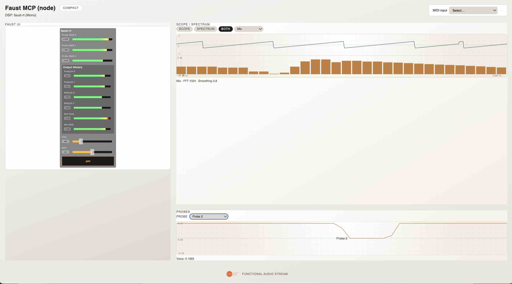
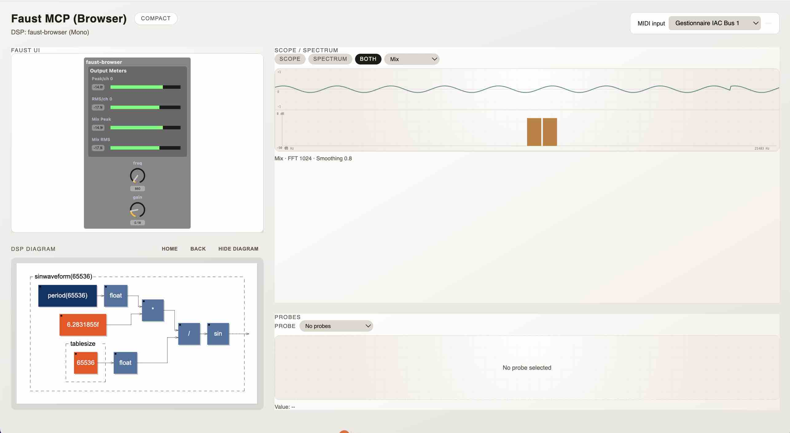
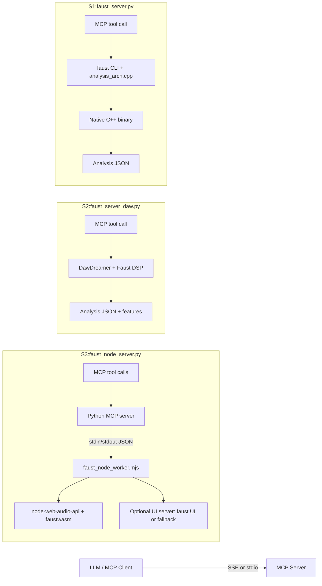

# Faust MCP Servers

<p>
  
  
</p>

This repository provides four MCP servers that compile, render, or play Faust DSP code:

- `faust_server.py`: C++ compile pipeline (Faust CLI + g++).
- `faust_server_daw.py`: DawDreamer offline render pipeline.
- `faust_node_server.py`: real-time playback via node-web-audio-api + Faust WASM.
- `faust_browser_server.py`: browser-only runtime proxy + static server.

For MCP protocol background, see:
- https://modelcontextprotocol.io

## Structure

- `faust_server.py`: MCP server entrypoint (FastMCP) and tool implementation.
- `faust_server_daw.py`: DawDreamer-based MCP server (no C++ compile step).
- `faust_node_server.py`: Real-time MCP server using node-web-audio-api + Faust WASM.
- `faust_browser_server.py`: Browser-only runtime proxy + static server.
- `faust_node_worker.mjs`: Node worker that hosts the real-time DSP graph.
- `analysis_arch.cpp`: Faust C++ architecture used to generate analysis data.
- `t1.dsp`, `t2.dsp`, `noise.dsp`, `probe.dsp`: Example Faust DSP programs.
- `sse_client_example.py`: SSE client example.
- `stdio_client_example.py`: stdio client example.
- `smoke_test.py`: Basic stdio smoke test for both offline servers.
- `Makefile`: Common run/test targets.
- `requirements.txt`: Client-side Python dependencies.

## Architecture overview

The project has three MCP server variants that share a common client interface,
but differ in how they compile/render Faust DSP code.


```mermaid
flowchart LR
  LLM[LLM / MCP Client] -->|SSE or stdio| MCP[MCP Server]

  subgraph Server3["S3:faust_node_server.py"]
    S3["MCP tool calls"] --> PY[Python MCP server]
    PY -->|stdin/stdout JSON| NODE[faust_node_worker.mjs]
    NODE --> NWA[node-web-audio-api + faustwasm]
    NODE --> UI["Optional UI server: faust UI or fallback"]
  end

  subgraph Server2["S2:faust_server_daw.py"]
    S2["MCP tool call"] --> DD["DawDreamer + Faust DSP"]
    DD --> JSON2[Analysis JSON + features]
  end

  subgraph Server1["S1:faust_server.py"]
    S1["MCP tool call"] --> CLI["faust CLI + analysis_arch.cpp"]
    CLI --> BIN[Native C++ binary]
    BIN --> JSON1[Analysis JSON]
  end
```

Notes:

- SSE is the recommended transport for web clients; stdio is useful for local CLI tools.
- The real-time server returns parameter metadata and current values, not offline analysis.
- Real-time tools: `compile_and_start`, `check_syntax`, `get_params`, `set_param`, `set_param_values`, `get_param`, `get_param_values`, `get_audio_metrics`, `save_wasm_module`, `load_wasm_module`, `get_midi_inputs`, `get_midi_status`, `select_midi_input`, `stop`.
- Offline tools: `compile_and_analyze`.
- DawDreamer and real-time servers accept optional `input_source` (`none`, `sine`, `noise`, `file`), `input_freq` (Hz), and `input_file` (path) to inject test inputs.

## Quick Start

```bash
make setup
make smoke-test DSP=t1.dsp
```

Real-time setup:

```bash
make setup-rt
```

MIDI input (Node backend):

- Use `get_midi_inputs` to list available inputs.
- Use `get_midi_status` to confirm the selected device and see the last MIDI message.
- Use `select_midi_input` with `index` or `name` to choose a single active device.
- Selection is session-only (no persistence across restarts).

Faust UI setup (optional):

```bash
make setup-ui
```

Cleanup:

```bash
make clean
```

## Shared Environment Variables

- `MCP_HOST` (default: `127.0.0.1`)
- `MCP_PORT` (default: `8000`)
- `MCP_TRANSPORT` (default: `sse`)
  - Supported values: `sse`, `streamable-http`, `stdio`
- `MCP_MOUNT_PATH` (optional, SSE only)
- `TMPDIR` (recommended) temp folder used by the compiler toolchain

## Server 1: C++ Compile Pipeline (`faust_server.py`)

### What it does

1. Accept a Faust DSP string via the `compile_and_analyze` tool.
2. Write it to a temporary `process.dsp` file.
3. Compile Faust DSP to C++ using `analysis_arch.cpp`.
4. Compile the generated C++ into a native binary (C++11+).
5. Run the binary to produce JSON analysis output.
6. Return the JSON result to the MCP client.

### Requirements

- Python 3.10+
- Faust CLI available in PATH (`faust`)
- C++ compiler (`g++`) with C++11+ support
- Python package `mcp`

### Run (SSE)

```bash
MCP_TRANSPORT=sse MCP_HOST=127.0.0.1 MCP_PORT=8000 \
TMPDIR=/path/to/tmp \
python3 faust_server.py
```

Default SSE endpoint:

- `http://127.0.0.1:8000/sse`

### Run (stdio)

```bash
MCP_TRANSPORT=stdio python3 faust_server.py
```

For `faust_server.py`, set `TMPDIR` to a writable path if compilation fails:

```bash
MCP_TRANSPORT=stdio TMPDIR=/tmp/faust-mcp-test python3 faust_server.py
```

### Tool: compile_and_analyze

**Input:**

- `faust_code` (string) - the DSP source code

**Output:**

JSON string with:

- `status`
- `max_amplitude`
- `rms`
- `is_silent`
- `waveform_ascii`
- `num_outputs`
- `channels` (array of per-output metrics)

### How analysis_arch.cpp computes outputs

The analysis is performed by `analysis_arch.cpp` and returns a JSON payload with
these fields:

- `status`: hard-coded to `"success"` when the binary completes.
- `max_amplitude`: maximum absolute value of the **mono mix** over the full render.
  The mono mix is the average of all output channels per sample.
- `rms`: root-mean-square of the mono mix over the full render.
- `is_silent`: `true` when `max_amplitude < 0.0001`, otherwise `false`.
- `waveform_ascii`: a 60-character ASCII summary of the mono mix. Each character
  represents a chunk of the rendered buffer and is chosen by peak magnitude:
  `_` for near-silence (< 0.01), `#` for > 0.5, `=` for > 0.2, and `-` otherwise.
- `num_outputs`: number of output channels produced by the DSP.
- `channels`: array of per-output objects with:
  - `index` (0-based output index)
  - `max_amplitude`
  - `rms`
  - `is_silent`
  - `waveform_ascii`

Render details:

- Sample rate: 44100 Hz
- Duration: 2 seconds (88200 samples)
- Processing block size: 256 frames

## Server 2: DawDreamer Offline Pipeline (`faust_server_daw.py`)

### What it does

This variant uses [DawDreamer](https://github.com/DBraun/DawDreamer) to compile
and render Faust DSP directly in Python, so you do not need to generate and compile C++ code.
It renders offline audio and returns the same analysis metrics plus a `dawdreamer` info block and
DawDreamer-only features.

### Requirements

- Python 3.10+
- `dawDreamer` (import name can be `dawDreamer` or `dawdreamer`)
- `numpy` for spectral features (otherwise `spectral_available` is `false`)

Install:

```bash
python3 -m pip install dawDreamer
```

### Environment variables

- `DD_SAMPLE_RATE`, `DD_BLOCK_SIZE`, `DD_RENDER_SECONDS` for rendering
- `DD_FFT_SIZE`, `DD_FFT_HOP`, `DD_ROLLOFF` for spectral analysis

### Tool additions

`compile_and_analyze` accepts optional `input_source` (`none`, `sine`, `noise`, `file`),
`input_freq` (Hz for sine, default 1000), and `input_file` (path for file) to inject
test inputs for effects. For DawDreamer, `input_file` must be a local WAV path
and requires `numpy` for decoding.

### Run (SSE)

```bash
MCP_TRANSPORT=sse MCP_HOST=127.0.0.1 MCP_PORT=8000 \
DD_SAMPLE_RATE=44100 DD_BLOCK_SIZE=256 DD_RENDER_SECONDS=2.0 \
python3 faust_server_daw.py
```

Makefile targets:

```bash
make run-daw
make client-daw DSP=t1.dsp
```

`make client-daw DSP=...` runs the SSE client against the DawDreamer server using
that DSP file. You can also use:

```bash
make client-sse DSP=t1.dsp
```

`compile_and_analyze` with a test input source (DawDreamer):

```bash
python3 sse_client_example.py --url http://127.0.0.1:8000/sse \
  --tool compile_and_analyze --dsp t1.dsp --input-source noise
```

### DawDreamer output additions

- `features` (global time + spectral features)
- Per-channel `features`
- `dawdreamer` object with render settings and version info

Example output (truncated):

```json
{
  "status": "success",
  "max_amplitude": 0.990577,
  "rms": 0.49998,
  "is_silent": false,
  "waveform_ascii": "############################################################",
  "num_outputs": 2,
  "features": {
    "dc_offset": 0.0001,
    "zero_crossing_rate": 0.022,
    "crest_factor": 1.98,
    "clipping_ratio": 0.0,
    "spectral_centroid": 1000.0,
    "spectral_bandwidth": 120.0,
    "spectral_rolloff": 1500.0,
    "spectral_flatness": 0.12,
    "spectral_flux": 0.04,
    "spectral_frame_size": 2048,
    "spectral_hop_size": 1024,
    "spectral_rolloff_ratio": 0.85,
    "spectral_available": true
  },
  "channels": [
    {
      "index": 0,
      "max_amplitude": 1.0,
      "rms": 0.707111,
      "is_silent": false,
      "waveform_ascii": "############################################################",
      "features": {
        "dc_offset": 0.0001,
        "zero_crossing_rate": 0.022,
        "crest_factor": 1.98,
        "clipping_ratio": 0.0,
        "spectral_centroid": 1000.0,
        "spectral_bandwidth": 120.0,
        "spectral_rolloff": 1500.0,
        "spectral_flatness": 0.12,
        "spectral_flux": 0.04,
        "spectral_frame_size": 2048,
        "spectral_hop_size": 1024,
        "spectral_rolloff_ratio": 0.85,
        "spectral_available": true
      }
    }
  ],
  "dawdreamer": {
    "version": "0.7.0",
    "sample_rate": 44100,
    "block_size": 256,
    "render_seconds": 2.0,
    "num_channels": 2
  }
}
```

## Server 3: Real-time WebAudio Pipeline (`faust_node_server.py`)

### What it does

This variant compiles Faust DSP code to WebAudio on the fly and plays it in real time
using the `node-web-audio-api` runtime. It returns parameter metadata extracted from
the Faust JSON so an LLM can control the running DSP (no offline analysis metrics).

[node-web-audio-api](https://github.com/ircam-ismm/node-web-audio-api) is an open-source Node.js implementation
of the Web Audio API that provides AudioContext/AudioWorklet support outside the browser, backed by
native audio I/O.

### Requirements

- Node.js
- `node-web-audio-api` checkout at `WEBAUDIO_ROOT` (submodule: `external/node-web-audio-api`)
- `@grame/faustwasm` installed in that checkout
- Optional: `@julusian/midi` backend for Node-side MIDI input (submodule: `external/node-midi`)
- Optional: `@shren/faust-ui` installed in `ui/` for the UI bridge

Environment variables:

- `WEBAUDIO_ROOT`: node-web-audio-api path (default `external/node-web-audio-api`)
- `FAUST_UI_PORT`: enable UI server on this port (optional)
- `FAUST_UI_ROOT`: path to a built `faust-ui` bundle (optional, overrides auto-detect)
- `FAUST_WORKER_PATH`: absolute path to `faust_node_worker.mjs` (optional)

Submodule setup (one-time):

```bash
git submodule update --init --recursive
cd external/node-web-audio-api
npm install
npm run build
```

MIDI backend setup (optional):

```bash
git submodule update --init --recursive external/node-midi
cd external/node-midi
npm install
npm run build:ts
```

### Notes

- The real-time server runs one DSP at a time; `compile_and_start` replaces it.
- Parameter paths come from Faust JSON, not `RT_NAME`. Use `make rt-get-params`.
- `npm run build` generates `node-web-audio-api.build-release.node` and should be re-run
  if you update the submodule or switch branches.
- If you get no sound, check OS audio permissions and the default output device.
- Set `FAUST_MIDI_DEBUG=1` to log raw MIDI messages and note-on/off counters (stderr).

### Run (SSE)

```bash
WEBAUDIO_ROOT=external/node-web-audio-api \
MCP_TRANSPORT=sse MCP_HOST=127.0.0.1 MCP_PORT=8000 \
python3 faust_node_server.py
```

### Optional UI bridge

Set `FAUST_UI_PORT` to start a small HTTP UI server (fallback sliders). If you
have the `@shren/faust-ui` package installed (in `ui/`), the server will auto-load
it. You can also point `FAUST_UI_ROOT` to a custom bundle directory so the page
can load `/faust-ui/index.js` and use it instead of the fallback UI.

The UI page (`ui/rt-node-ui.html`) connects to the running DSP over a lightweight
HTTP JSON API hosted by the Node worker (`faust_node_worker.mjs`) using
Node's built-in `http` server. This is separate from the MCP transport: MCP
still runs over SSE/stdio between the Python server and the client, while the UI
talks directly to the worker via HTTP.

Endpoints used by the UI:

- `GET /status`: current DSP name and running status
- `GET /json`: full Faust JSON for the current DSP
- `GET /params`: cached parameter metadata
- `GET /param-values`: current parameter values (polled)
- `POST /param`: set a parameter value `{ path, value }`
- `GET /audio-metrics`: scope/spectrum/probe data (polled)
- `WS /ws`: optional metrics stream (scope/spectrum/probes) for the UI
- `GET /faust-ui/*`: static assets for `@shren/faust-ui` (optional)

The page polls `/json` and `/status` to detect DSP changes, and polls
`/param-values` on a short interval to keep the UI in sync with parameter
updates coming from MCP (`set_param`). It also polls `/audio-metrics` to render
scope/spectrum data and build the probe scope history buffer. When `/ws` is
available, the UI switches to WebSocket streaming and falls back to polling if
the WS connection is unavailable.
For polyphonic DSPs, the UI also shows the current count of active voices
just below the MIDI device selector.

Probe scopes are derived from `get_audio_metrics().probes` values. The UI
selects a probe ID and plots a rolling history of those values (no extra DSP
analysis is required).
For details on the WebSocket analysis stream, see `docs/ws-metrics.md`.

```bash
WEBAUDIO_ROOT=external/node-web-audio-api \
FAUST_UI_PORT=8787 FAUST_UI_ROOT=/path/to/faust-ui/dist/esm \
MCP_TRANSPORT=sse MCP_HOST=127.0.0.1 MCP_PORT=8000 \
python3 faust_node_server.py
```

If you want Claude Code over stdio and the UI at the same time, run the server
in stdio mode with `FAUST_UI_PORT` set:

```bash
WEBAUDIO_ROOT=external/node-web-audio-api \
FAUST_UI_PORT=8787 FAUST_UI_ROOT=/path/to/faust-ui/dist/esm \
MCP_TRANSPORT=stdio \
python3 faust_node_server.py
```

Then open:

- `http://127.0.0.1:8787/`

## Server 4: Browser-Only Runtime

This runtime keeps DSP compilation + audio + UI entirely in the browser. A small
Python proxy (`faust_browser_server.py`) serves static assets and optionally
exposes MCP tools over SSE/stdio via a long-polling bridge.

### Setup

```bash
make setup-ui-browser
```

### Run

Recommended:

```bash
make run-browser-ui
```

```bash
MCP_TRANSPORT=sse MCP_HOST=127.0.0.1 MCP_PORT=8000 \\
python3 faust_browser_server.py
```

Open the UI in a browser:

- `http://127.0.0.1:8010/`

Notes:

- The browser must be real (WebAudio + Web MIDI); headless is not supported.
- Tool calls from MCP clients are forwarded to the browser via `/bridge/*`.
- `make test-browser-api` runs the full MCP tool sequence (requires a browser tab open).
- SVG diagrams are rendered in the browser UI (DSP Diagram panel) and support in-SVG navigation.

### Quick DSP example

You can prefill DSP code via query param:

- `http://127.0.0.1:8010/?dsp=process%3Dos.osc(440)%3B`

### Claude Desktop setup (browser-only)

Add a new MCP server entry in Claude Desktop’s config (stdio transport):

```json
{
  "mcpServers": {
    "faust-browser": {
      "command": "python3",
      "args": [
        "/path/to/faust-mcp/faust_browser_server.py"
      ],
      "env": {
        "MCP_TRANSPORT": "stdio",
        "BROWSER_UI_HOST": "127.0.0.1",
        "BROWSER_UI_PORT": "8010",
        "BROWSER_UI_ROOT": "/path/to/faust-mcp",
        "BROWSER_UI_INDEX": "ui/rt-browser-ui.html"
      }
    }
  }
}
```

Then:

1) Open `http://127.0.0.1:8010/` in a browser and click **Unlock Audio** (or call `unlock_audio` from an MCP client in a user gesture).
2) In Claude, choose the `faust-browser` server and call tools.

### Claude Desktop setup (both faust-node + faust-browser)

If you want both runtimes available, add two entries:

```json
{
  "mcpServers": {
    "faust-node": {
      "command": "python3",
      "args": [
        "/path/to/faust-mcp/faust_node_server.py"
      ],
      "env": {
        "MCP_TRANSPORT": "stdio",
        "WEBAUDIO_ROOT": "/path/to/faust-mcp/external/node-web-audio-api",
        "FAUST_UI_PORT": "8787",
        "FAUST_WORKER_PATH": "/path/to/faust-mcp/faust_node_worker.mjs"
      }
    },
    "faust-browser": {
      "command": "python3",
      "args": [
        "/path/to/faust-mcp/faust_browser_server.py"
      ],
      "env": {
        "MCP_TRANSPORT": "stdio",
        "BROWSER_UI_HOST": "127.0.0.1",
        "BROWSER_UI_PORT": "8010",
        "BROWSER_UI_ROOT": "/path/to/faust-mcp",
        "BROWSER_UI_INDEX": "ui/rt-browser-ui.html"
      }
    }
  }
}
```

### Real-time tools

- `compile_and_start(faust_code, name?, latency_hint?, input_source?, input_freq?, input_file?, hide_meters?)`
- `compile(faust_code, name?, input_source?, input_freq?, input_file?, hide_meters?)`
- `start()`
- `unlock_audio(latency_hint?)` (browser-only)
- `check_syntax(faust_code, name?)`
- `get_status()`
- `get_params()`
- `get_dsp_json()`
- `get_param(path)`
- `get_param_values()`
- `get_audio_metrics(include_scope?, include_spectrum?, per_channel?, fft_size?, smoothing?, min_db?, max_db?, edge_threshold?, log_bins?)`
- `get_midi_inputs()`
- `get_midi_status()`
- `select_midi_input(index?, name?)`
- `set_param_values(values)`
- `set_param(path, value)`
- `stop()`

`get_audio_metrics()` returns RMS/peak metering derived from bargraphs that are
automatically injected by the real-time server when it wraps your Faust DSP
code. The wrapper adds output meters for each channel and a mono mix meter
(Mix Peak/Mix RMS). Output meters are always injected; input meters are only
injected when `input_source` is `sine`, `noise`, or `file`. `get_audio_metrics()`
returns input meters under `input.channels` and output meters under `output`.
If you want to hide the meters in compatible UIs, pass `hide_meters=true` to
`compile_and_start`.

`hasNaN` is reported for the output mix and each output channel (inputs omit it).

Metering/probe bargraphs are added via `attach`, so they do **not** change the
DSP audio I/O count. The compiled DSP keeps the same number of inputs/outputs;
only UI bargraphs are appended for metering/probing.
When a polyphonic DSP defines `effect`, the wrapper re-exports it at top level
so faustwasm can apply it post-mix. In that mode, mix meters are attached via
an in-place tap so output arity stays unchanged.

When a bargraph includes `[unit:dB]` metadata, `get_audio_metrics()` converts its
value to linear amplitude before returning it. The conversion is
`linear = 10^(dB/20)`, so you can apply linear thresholds like `rms < 0.001` for
silence detection or `peak > 1.0` for clipping heuristics. Bargraphs without the
`[unit:dB]` tag are returned as-is.

If a bargraph includes `[probe:N]` metadata (with `N` as an integer), its value
is added to the `probes` array in `get_audio_metrics()` as `{ id, value }`. This
lets MCP clients inject extra metering probes into the DSP graph and retrieve
them alongside the standard mix/channel meters.

Optional scope/spectrum capture:
- `include_scope`: include time-domain samples aligned to a rising edge.
- `include_spectrum`: include FFT bins (dB) and frequency axis.
- `per_channel`: include per-channel scope/spectrum arrays.
- `fft_size`, `smoothing`, `min_db`, `max_db`, `edge_threshold`, `log_bins`: analyser tuning.
Makefile helpers:
- `make rt-get-audio-metrics-scope`
- `make rt-get-audio-metrics-spectrum`
- `make rt-get-audio-metrics-full`
- `make rt-get-audio-metrics-full-per-channel`
- `make rt-ws-metrics`

### Response schema versioning

Real-time tool responses include `schema_version` (currently `faust-mcp-rt/1`).
This allows MCP clients to detect changes and adapt safely.

Structured errors are returned as:

```json
{
  "error": {
    "schema_version": "faust-mcp-rt/1",
    "code": "compile_failed",
    "message": "Faust compilation failed",
    "details": { "stage": "poly" }
  }
}
```

### Tool: get_status

`get_status()` returns a snapshot of the current DSP runtime state:

```json
{
  "schema_version": "faust-mcp-rt/1",
  "running": true,
  "name": "faust-rt",
  "poly_nvoices": 8,
  "midi_enabled": true,
  "midi_active_notes": 3
}
```

### Tool: get_midi_status

`get_midi_status()` returns the Node MIDI backend state for the current session,
including the selected input (if any) and the most recent MIDI message.

```json
{
  "status": "ok",
  "available": true,
  "selected": { "index": 1, "name": "MidiKeys" },
  "last_message": { "data": [176, 7, 64], "timestamp": 1736367076123 }
}
```

```json
{
  "input": {
    "channels": [
      { "rms": 0.2, "peak": 0.42 }
    ]
  },
  "output": {
    "mix": { "rms": 0.23, "peak": 0.45, "hasNaN": false },
    "channels": [
      { "rms": 0.2, "peak": 0.42, "hasNaN": false },
      { "rms": 0.25, "peak": 0.48, "hasNaN": false }
    ]
  },
  "probes": [
    { "id": 0, "value": 0.57 }
  ]
}
```

`latency_hint` accepts `interactive` (default) or `playback`.
`input_source` accepts `none` (default), `sine`, `noise`, or `file`. `input_freq`
sets the sine frequency in Hz (default 1000). `input_file` sets the path for a
soundfile input when `input_source=file`. `hide_meters` (default `false`) appends
`[hidden:1]` to the meter bargraph labels so compatible UIs can hide them.

Example (hide meter bargraphs):

```bash
make rt-compile DSP=t2.dsp HIDE_METERS=1
```

Stdio client example:

```bash
python3 stdio_client_example.py --server faust_node_server.py \
  --tool compile_and_start --dsp t2.dsp --hide-meters
```

For the real-time server (faustwasm), soundfiles must be served over HTTP/HTTPS.
To test local files, start a simple server in the repo root:

```bash
python3 -m http.server 9000
```

### Python ↔ Node worker bridge

The real-time server runs a Node worker process and talks to it over stdin/stdout:

- `faust_node_server.py` starts the worker with `node faust_node_worker.mjs`
  (override with `FAUST_WORKER_PATH`) and passes `WEBAUDIO_ROOT` in the environment.
- The worker reads JSON lines like:
  `{ "id": 1, "method": "compile_and_start", "params": {...} }`
- It responds with:
  `{ "id": 1, "result": {...} }` or `{ "id": 1, "error": "..." }`
- The Python server forwards MCP tool calls to the worker and returns the result.

## Example DSP Files

`t1.dsp`:

```faust
import("stdfaust.lib");

cutoff = hslider("cutoff[Hz]", 1200, 50, 8000, 1);
drive = hslider("drive[dB]", 0, -24, 24, 0.1) : ba.db2linear;

process = _ * drive : fi.lowpass(2, cutoff);
```

`t2.dsp`:

```faust
import("stdfaust.lib");

freq1 = hslider("freq1[Hz]", 500, 50, 2000, 1);
freq2 = hslider("freq2[Hz]", 600, 50, 2000, 1);
gain = hslider("gain[dB]", -6, -60, 6, 0.1) : ba.db2linear;

process = os.osc(freq1) * gain, os.osc(freq2) * gain;
```

`noise.dsp`:

```faust
import("stdfaust.lib");

gain = hslider("gain[dB]", -6, -60, 6, 0.1) : ba.db2linear;

process = no.noise * gain;
```

`organ_poly.dsp` (polyphonic organ):

```faust
import("stdfaust.lib");
declare options "[midi:on][nvoices:8]";
process = os.osc(440) <: _,_;
```

`poly_fx.dsp` (polyphonic voices + global effect):

```faust
import("stdfaust.lib");
declare options "[midi:on][nvoices:8]";
process = os.osc(440) <: _,_;
effect = _,_ : + : fi.lowpass(2, 8000) : ef.reverb_mono(0.3, 0.5, 0.5, 1) <: _,_;
```

`probe.dsp`:

```faust
import("stdfaust.lib");

probe_rms_db(id, hide, x) = x <: attach(x, an.rms_envelope_rect(0.1)
  : max(0.00001) : ba.linear2db
  : hbargraph("Probe RMS%2id[probe:%id][unit:dB][hidden:%hide]", -60, 0));

probe_rms_lin(id, hide, x) = x <: attach(x, an.rms_envelope_rect(0.1)
  : hbargraph("Probe RMS%2id[probe:%id][hidden:%hide]", 0, 1));
  
probe_peak_db(id, hide, x) = x <: attach(x, an.peak_envelope(0.1)
  : max(0.00001) : ba.linear2db
  : hbargraph("Probe Peak%2id[probe:%id][unit:dB][hidden:%hide]", -60, 0));

probe_peak_lin(id, hide, x) = x <: attach(x, an.peak_envelope(0.1)
  : hbargraph("Probe Peak%2id[probe:%id][hidden:%hide]", 0, 1));

freq = hslider("freq", 440, 20, 2000, 1);
gain = hslider("gain", 0.5, 0, 1, 0.01);
gate = button("gate");

// Pipeline with probes at each stage
osc = os.sawtooth(freq) : probe_rms_db(0, 0);
shaped = osc * en.adsr(0.01, 0.1, 0.7, 0.3, gate) : probe_rms_db(1, 0);
output = shaped * gain : probe_rms_db(2, 0);

process = output <: _,_;
```

### DSP wrapper utility

To inspect the Faust code that the real-time server generates (metering + test inputs),
use `scripts/emit_wrapped_dsp.mjs`:

```bash
node scripts/emit_wrapped_dsp.mjs --dsp poly_fx.dsp --out poly_fx_wrapped.dsp
```

## Clients

## LLM + MCP usage

Example flow for Claude Code or another MCP-capable LLM:

1. Start the desired server (`faust_server.py`, `faust_server_daw.py`, or `faust_node_server.py`).
2. The LLM connects over SSE or stdio and lists available tools.
3. The LLM sends DSP code to `compile_and_analyze` (offline servers) or `compile_and_start` (real-time).
4. The server returns analysis metrics (offline) or parameter metadata (real-time).
5. The LLM uses `set_param/set_param_values` to adjust controls, and `get_param/get_param_values` to read back state.

Minimal real-time loop (conceptual):

```text
compile_and_start(faust_code="...", name="osc1")
get_param_values()
set_param(path="/freq", value=440)
set_param_values(values=[{"path": "/gain", "value": 0.2}, {"path": "/cutoff", "value": 1200}])
```

To list available tools from a local SSE server, use:

```bash
python3 scripts/list_tools.py
python3 scripts/list_tools.py --details
```

## Typical use cases

Local file server for soundfile inputs:

```bash
python3 -m http.server 9000
```

Offline analysis with a sine test input (DawDreamer):

```bash
make run-daw
make client-daw DSP=t1.dsp INPUT_SOURCE=sine INPUT_FREQ=1000
```

Offline analysis with a soundfile test input (DawDreamer, local path):

```bash
make run-daw
make client-daw DSP=t1.dsp INPUT_SOURCE=file INPUT_FILE=tests/assets/sine.wav
```

If you see `addSoundfile : soundfile for sound cannot be created`, make sure the
path points to a local WAV file (HTTP URLs are for the real-time server).

Real-time compile with noise test input:

```bash
make run-rt
make rt-compile DSP=t1.dsp RT_NAME=fx INPUT_SOURCE=noise
```

Real-time compile with a soundfile test input (HTTP URL):

```bash
make run-node-ui
make rt-compile DSP=t1.dsp RT_NAME=fx INPUT_SOURCE=file INPUT_FILE=http://127.0.0.1:9000/tests/assets/sine.wav
```

### SSE client

```bash
python3 sse_client_example.py --url http://127.0.0.1:8000/sse --dsp t1.dsp
```

`compile_and_start` example:

```bash
python3 sse_client_example.py --url http://127.0.0.1:8000/sse \
  --tool compile_and_start --dsp t1.dsp --name osc1 --latency interactive
```

With a test input source:

```bash
python3 sse_client_example.py --url http://127.0.0.1:8000/sse \
  --tool compile_and_start --dsp t1.dsp --name osc1 --latency interactive \
  --input-source sine --input-freq 1000
```

With a file test input:

```bash
python3 sse_client_example.py --url http://127.0.0.1:8000/sse \
  --tool compile_and_start --dsp t1.dsp --name osc1 --latency interactive \
  --input-source file --input-file http://127.0.0.1:9000/tests/assets/sine.wav
```

`tests/assets/sine.wav` is a mono 1 kHz test file included in this repo.

### Full API test script

The helper script `scripts/test_full_api.sh` runs all SSE tools in one go and
optionally checks the UI HTTP server endpoints.

```bash
# Requires the real-time server to be running (see make run-node-ui).
scripts/test_full_api.sh
```

To skip UI checks (port 8787), use:

```bash
SKIP_UI=1 scripts/test_full_api.sh
```

You can override URLs and DSP selection with environment variables:

```bash
MCP_URL=http://127.0.0.1:8000/sse \
MCP_HTTP_BASE=http://127.0.0.1:8000 \
UI_HTTP_BASE=http://127.0.0.1:8787 \
DSP=t2.dsp NAME=faust-rt \
scripts/test_full_api.sh
```

### CI batch audio check

`scripts/ci_batch_audio.py` compiles a batch of DSPs, collects audio metrics, and
flags silence/clipping/NaN issues. It also reports probe values when available,
so you can validate RMS/peak/probe signals across a DSP library.

```bash
# Requires the real-time server to be running (see make run-node-ui).
scripts/ci_batch_audio.py --glob "*.dsp" --input-source sine --input-freq 1000
```

You can adjust thresholds and warmup time:

```bash
scripts/ci_batch_audio.py --silence-threshold 0.001 --clip-threshold 1.0 --warmup-ms 400
```

Require probes to be present (fail otherwise):

```bash
scripts/ci_batch_audio.py --require-probes
```

### Scripts reference

This repo ships a few helper scripts under `scripts/`:

- `scripts/ci_batch_audio.py`: Batch compile DSPs, collect `get_audio_metrics()`, and flag silence/clipping/NaN. Supports optional probe checks (`--require-probes`).
- `scripts/emit_wrapped_dsp.mjs`: Emit the Faust DSP code after MCP wrapping (useful to debug input/meters/effect wrapping).
- `scripts/list_tools.py`: List MCP tools exposed by a running server (use `--details` for schema and params).
- `scripts/test_full_api.sh`: End-to-end SSE tool exercise plus optional UI endpoint checks.
- `scripts/test_ws_metrics.py`: Connect to `/ws`, subscribe, and wait for a metrics frame.
- `scripts/verify_sse.py`: Lightweight SSE connectivity check for CI/health probes.

Quick examples:

```bash
python3 scripts/list_tools.py --details
node scripts/emit_wrapped_dsp.mjs --dsp t2.dsp
scripts/verify_sse.py --url http://127.0.0.1:8000/sse
scripts/test_ws_metrics.py --url ws://127.0.0.1:8787/ws --include-scope --include-spectrum
```

### stdio client

```bash
# Defaults to faust_node_server.py; pass --server to target other servers.
python3 stdio_client_example.py --dsp t1.dsp
```

Real-time over stdio:

```bash
MCP_TRANSPORT=stdio python3 faust_node_server.py
```

```bash
python3 stdio_client_example.py --server faust_node_server.py \
  --tool compile_and_start --dsp t1.dsp --name fx --latency interactive \
  --input-source noise
```

For an SSE-like loop in stdio (compile multiple DSPs in one session), use:

```bash
FAUST_UI_PORT=8787 python3 stdio_rt_session.py --dsp t1.dsp --dsp t2.dsp
```

## Local verification checklist

These commands exercise the common server/client combinations on a local machine:

```bash
# C++ server (stdio)
python3 stdio_client_example.py --server faust_server.py --dsp t1.dsp --tmpdir /tmp/faust-mcp-test

# DawDreamer server (stdio, file input)
python3 stdio_client_example.py --server faust_server_daw.py --dsp t1.dsp \
  --input-source file --input-file tests/assets/sine.wav

# Real-time server (SSE)
WEBAUDIO_ROOT=external/node-web-audio-api MCP_PORT=8000 \
python3 faust_node_server.py

python3 sse_client_example.py --url http://127.0.0.1:8000/sse \
  --tool compile_and_start --dsp t1.dsp --name fx --latency interactive \
  --input-source noise
```

### Makefile real-time helpers

```bash
make run-rt
make run-node-ui
make run-rt-stdio
make run-rt-stdio-ui
make run-rt-stdio-session
make rt-compile DSP=t1.dsp RT_NAME=osc1
make rt-get-params
make rt-get-param RT_PARAM_PATH=/freq
make rt-get-audio-metrics
make rt-set-param RT_PARAM_PATH=/freq RT_PARAM_VALUE=440
make rt-stop
make stop-rt
```

## Transport matrix

| Server                     | Transport | Client                                          | Works |
| -------------------------- | --------- | ----------------------------------------------- | ----- |
| `faust_server.py`          | SSE       | `sse_client_example.py` / `make client-sse`     | Yes   |
| `faust_server.py`          | stdio     | `stdio_client_example.py` / `make client-stdio` | Yes   |
| `faust_server_daw.py`      | SSE       | `sse_client_example.py` / `make client-daw`     | Yes   |
| `faust_server_daw.py`      | stdio     | `stdio_client_example.py`                       | Yes   |
| `faust_node_server.py` | SSE       | `sse_client_example.py`                         | Yes   |
| `faust_node_server.py` | stdio     | `stdio_client_example.py`                       | Yes   |

## Client configuration examples

### Claude Desktop (SSE)

Edit `~/.config/Claude/claude_desktop_config.json` and add:

```json
{
  "mcpServers": {
    "faust": {
      "type": "sse",
      "url": "http://127.0.0.1:8000/sse"
    }
  }
}
```

### Claude Desktop (stdio, real-time)

If you use stdio with Claude Desktop, set a working directory (if supported)
or pass `FAUST_WORKER_PATH` so the server can locate the Node worker:

```json
{
  "mcpServers": {
    "faust": {
      "command": "python3",
      "args": ["/path/to/faust-mcp/faust_node_server.py"],
      "cwd": "/path/to/faust-mcp",
      "env": {
        "MCP_TRANSPORT": "stdio",
        "WEBAUDIO_ROOT": "/path/to/faust-mcp/external/node-web-audio-api",
        "FAUST_UI_PORT": "8787",
        "FAUST_WORKER_PATH": "/path/to/faust-mcp/faust_node_worker.mjs"
      }
    }
  }
}
```

### Generic MCP config (stdio)

If your MCP client reads a `servers.json` file, add a stdio server entry:

```json
{
  "servers": {
    "faust": {
      "command": "python3",
      "args": ["/path/to/faust-mcp/faust_server.py"],
      "env": {
        "MCP_TRANSPORT": "stdio",
        "TMPDIR": "/path/to/faust-mcp/tmp"
      }
    }
  }
}
```

## Troubleshooting

- If the compiler cannot create temp files, set `TMPDIR` to a writable location.
- Ensure the `tmp/` directory exists if you use `TMPDIR=./tmp` (create it once with `mkdir -p tmp`).
- If the server cannot bind to `127.0.0.1:8000`, either stop the process using
  that port or change `MCP_PORT` to another value.
