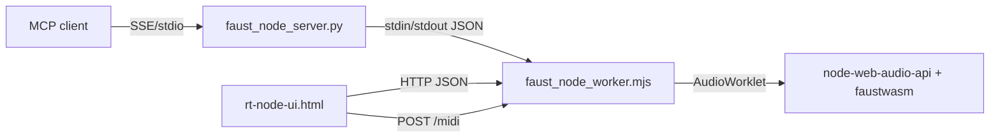

# Detailed Plan - Option A: Poly + MIDI via rt-node-ui (Node worker)

## Positioning (alternative plan)

This document describes **Option A** where the Node worker + rt-node-ui.html remain in place.
The alternative architecture (**Option B**) is documented separately in:
plan-mcp-llm-python-pwa.md.

## 0) Current state (implemented already)

- rt-node-ui frontend moved into `ui/rt-node-ui.js` and served by the worker at `/rt-node-ui.js`.
- Node-side MIDI backend is handled by a git submodule at `external/node-midi`.
  - `make setup-midi` initializes submodule + builds TS (`npm run build:ts`).
  - MIDI devices are listed via `/midi/inputs` and selected via `/midi/select`.
- `faustwasm` now exposes `setInputParamHandler`; the worker caches input param changes so UI polling shows MIDI-driven updates.
- rt-node-ui has a MIDI device selector and status feedback.

## 0) Useful references (existing code)

- Web MIDI + poly:
  - https://github.com/grame-cncm/faust-web-component/blob/main/src/common.ts
    - accessMIDIDevice() (Web MIDI), midiInputCallback() -> node.midiMessage(...)
    - extractMidiAndNvoices() (parse [midi:on] + [nvoices:n])
  - https://github.com/grame-cncm/faust-web-component/blob/main/src/faust-editor.ts
    - compile mono then poly if nvoices > 0, createNode(audioCtx, nvoices)
- MIDI + poly in PWA:
  - https://github.com/grame-cncm/faustwasm/blob/master/assets/standalone/faust-pwa.js
    - startMIDI()/stopMIDI() -> faustNode.midiMessage(event.data)
    - create() drives voices (poly) via createFaustNode(...)

## 1) Polyphony in faust_node_worker.mjs (post-refactor layout)

Goal: compile mono or poly based on [nvoices:n] metadata or an explicit param.

### Connection model (MCP <-> worker <-> UI)



```text
MCP client
  |  SSE/stdio
  v
faust_node_server.py (Python)
  |  stdin/stdout JSON
  v
faust_node_worker.mjs (Node)
  |  AudioWorklet -> node-web-audio-api + faustwasm
  |
  +-- HTTP JSON <---- rt-node-ui.html (browser)
  +-- POST /midi <--- rt-node-ui.html (browser)
```

### OS processes involved

- MCP client process: MCP tool (LLM client, script, etc.) talking SSE/stdio to the server.
- Python process: faust_node_server.py exposes MCP API and launches/controls the Node worker.
- Node.js process: faust_node_worker.mjs runs in a separate Node process, handles WebAudio, faustwasm, and the HTTP UI server.
- Browser process: rt-node-ui.html runs in a browser tab, calls the worker over HTTP and sends MIDI to /midi.
  Notes:
- The UI HTTP server is inside the Node process (not a separate process).
- Real-time audio output comes from the Node process, not the browser.

1. Load FaustPolyDspGenerator in **FaustCompilerManager** (faust_node_worker.mjs):
   - Extend ensureReady() to capture FaustPolyDspGenerator alongside FaustMonoDspGenerator.
   - Provide createPolyGenerator() similar to createGenerator().
2. Add extractMidiAndNvoices(jsonMeta) (new helper):
   - Place in a small helper module (e.g. faust_dsp_utils.mjs) next to extractBargraphUnits.
   - Logic based on https://github.com/grame-cncm/faust-web-component/blob/main/src/common.ts.
3. Two-phase compile in **WorkerRuntime.compileAndStart**:
   - Compile once with mono generator to read meta/json.
   - Determine nvoices + midiEnabled from JSON meta.
4. Create the node:
   - If nvoices > 0 (or force_poly), use FaustPolyDspGenerator + createNode(audioContext, nvoices).
   - Otherwise, keep mono.
5. Store runtime state in WorkerRuntime:
   - midiEnabled, polyNvoices, polyMode.
6. Expose in UI server `/status`:
   - Add midi_enabled, poly_nvoices, poly_mode in UiServer response.

### Implementation steps (polyphony only via [nvoices:n])

1. **Add metadata parser** in `faust_dsp_utils.mjs`:
   - Implement `extractMidiAndNvoices(jsonMeta)` returning `{ midiEnabled, nvoices }`.
   - Parse `json.meta` for `options` entry; read `[midi:on]` and `[nvoices:n]`.
2. **Extend compiler manager** in `faust_node_worker.mjs`:
   - In `FaustCompilerManager.ensureReady()`, capture `FaustPolyDspGenerator`.
   - Add `createPolyGenerator()` method.
3. **Two‑phase compile in WorkerRuntime.compileAndStart**:
   - Compile with mono generator to read JSON/meta.
   - Call `extractMidiAndNvoices(faustJson.meta)`; if `nvoices > 0`, recompile with poly generator.
4. **Create node based on meta**:
   - When `nvoices > 0`, call `polyGenerator.createNode(audioContext, nvoices)`.
   - Otherwise use mono generator (current path).
5. **Track runtime state**:
   - Add `this.polyNvoices` and `this.midiEnabled` in `WorkerRuntime.resetState()`.
   - Populate from meta in compile path.
6. **Expose status**:
   - Extend `/status` response with `midi_enabled` and `poly_nvoices`.
7. **UI polish**:
   - In `ui/rt-node-ui.js`, show “Poly: N voices” or “Mono”.
8. **Manual test**:
   - Compile a DSP with `[nvoices:8]` and confirm `/status` + audio are polyphonic.

### Global effect support (process + effect)

Goal: allow Faust DSPs that define a global `effect` to work correctly in poly mode.
Example pattern:

```faust
process = voice * 0.3 <: _, _;
effect = _, _ : + : fi.lowpass(2, 8000) : ef.reverb_mono(0.3, 0.5, 0.5, 1) <: _, _;
```

Problem: the current wrapper nests user code in `environment { ... }` and only exposes
`mcp_dsp.process`, so a top-level `effect` is hidden from the poly compiler (or not
metered correctly).

Steps:

1. **Detect `effect` in DSP source**:
   - Add a simple parser/regex in `faust_dsp_utils.mjs` to detect top-level `effect =`.
   - Keep it lightweight (string scan) and treat it as a best-effort flag.
2. **Expose `effect` at top level in the wrapper**:
   - Keep the `environment` wrapper but re-export `process` and `effect`:
     - `process = mcp_dsp.process;`
     - `effect = mcp_dsp.effect;` (only if `effect` exists).
3. **Apply meters at the right stage**:
   - If `effect` exists, apply **output metering to `effect`**, not `process`, so meters
     reflect post‑FX audio:
     - `effect = mcp_dsp.effect : mcp_output_meters(mcp_dsp.effect);`
   - If `effect` does not exist, keep the current `process : mcp_output_meters(process)` path.
4. **Input metering stays pre‑voice**:
   - For `input_source` paths, keep `mcp_input_meters(mcp_dsp.process)` before the voice
     and avoid duplicating meters on the effect.
5. **Poly compile still sees `process` + `effect`**:
   - With `effect` re‑exported at top level, the poly generator should apply it after
     voice mixing (standard Faust poly behavior).
6. **Add a test DSP**:
   - Add a `poly_fx.dsp` example that defines `process` + `effect` and uses `[nvoices:n]`.
   - Verify audio output (FX audible) and metering matches post‑FX output.

### Constraints (initial implementation)

- Polyphony is enabled **only** when `[nvoices:n]` is present in the DSP metadata.
- If `[nvoices:n]` is missing, the node stays mono (no implicit defaults).
- `compile_and_start` does not override this rule for now.

## 2) MIDI API on the worker (UiServer route)

Goal: allow rt-node-ui.html to send MIDI.

1. Node-side MIDI input (current path):
   - MIDI device list: `GET /midi/inputs`.
   - MIDI device select: `POST /midi/select` ({ index } or { name }).
   - Node worker forwards events to `faustNode.midiMessage(...)`.
2. Optional Web MIDI POST path (if you want a browser-only fallback):
   - `POST /midi` with { data: [144, 60, 100] }.
   - Only needed if you want browser Web MIDI without node-midi.
3. Guards:
   - If no DSP running -> 409/400.
   - If midiEnabled is false -> 403 or ignore.
4. JSON response:
   - { status: "ok" } or { error: "..." }.

## 3) MCP parameters on the Python server

Goal: expose poly controls on MCP.

1. Extend compile_and_start in https://github.com/grame-cncm/faust-mcp/blob/main/faust_node_server.py:
   - nvoices?: number
   - force_poly?: boolean
2. Forward these params to the worker.
3. Update https://github.com/grame-cncm/faust-mcp/blob/main/README.md to document these options.

## 4) Web MIDI UI in rt-node-ui.html

Goal: a simple, robust MIDI interface.

1. UI:
   - MIDI input selector is in `ui/rt-node-ui.js` and polls `/midi/inputs`.
   - Show only if midi_enabled is true (via `/status`).
2. Optional Web MIDI (if POST /midi is kept):
   - navigator.requestMIDIAccess() + access.onstatechange to list devices.
   - input.onmidimessage = (e) => postMidi(e.data).

## 5) Poly UI signals

Goal: clear feedback.

1. Show "Poly: N voices" or "Mono" in the UI header (via /status).
2. Optional: warn if [nvoices:n] found but node is mono (if force_poly is false).

## 6) Recommended manual tests

1. Poly MIDI DSP:
   ```faust
   // [midi:on][nvoices:8]
   import("stdfaust.lib");
   process = pm.pluckString;
   ```
2. Start faust_node_server.py + UI.
3. Verify:
   - status returns poly_nvoices and midi_enabled: true.
   - MIDI UI lists devices.
   - Note On/Off produces sound.

## 7) Risks / attention points

- Web MIDI requires https or localhost -> OK on 127.0.0.1.
- midiMessage() must exist on the node (confirmed by faust-pwa.js).
- If FaustPolyDspGenerator does not work in node-web-audio-api, provide a mono fallback.
- Web MIDI via HTTP POST can add latency/jitter (browser event loop + HTTP overhead).
  - OK for casual control, but not “hard” real-time.
  - For tighter timing, consider a more integrated path (node MIDI input or a low-overhead binary socket).
